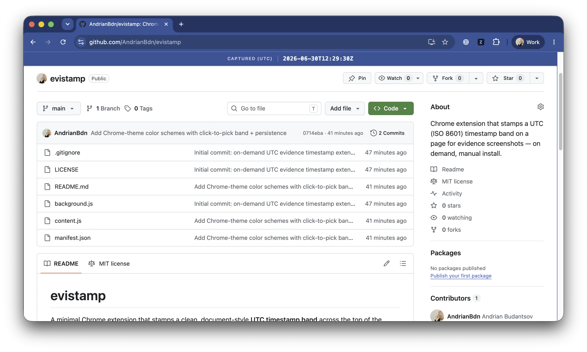

# evistamp

A minimal Chrome extension that stamps a clean, document-style **UTC timestamp band**
across the top of the current page — on demand — so it's captured in evidence
screenshots (e.g. for ISO audits or compliance records).

- Click the toolbar button to stamp the page; click again to remove it
- Strict ISO 8601, UTC, second precision, frozen at click: `2026-07-01T13:02:47Z`
- Rendered as a formal exhibit-style band: near-white, ink-navy tabular monospace,
  a `CAPTURED (UTC)` label and hairline rules
- Page content is pushed down so the band never covers what you're capturing
- Lands in the shot for both full-window grabs *and* in-page/viewport captures,
  since the stamp is part of the rendered page
- **Click the band** to pick a color scheme — Chrome's own customize-chrome
  palette (Blue, Teal, Midnight Blue, Green, …) so the stamp can match your
  browser's chrome color. Your choice is saved and reused on every page.

> Not published on the Chrome Web Store — install manually (load unpacked) below.

## Install (load unpacked)

1. Download or clone this repository
2. Open `chrome://extensions`
3. Toggle **Developer mode** (top-right) on
4. Click **Load unpacked** and select the project folder
5. Pin **evistamp** from the puzzle-piece menu, then click it on any page to stamp

## How it works

- `background.js` listens for the toolbar button click and injects `content.js` into
  the active tab via `chrome.scripting`.
- `content.js` adds (or, on a second click, removes) the fixed timestamp band and
  pushes the page down by its height. Clicking the band opens the color-scheme
  picker; the chosen scheme is persisted with `chrome.storage.local` and the band's
  text/rule colors auto-adapt to light vs. dark backgrounds for legibility.
- Permissions are limited to `activeTab` + `scripting` + `storage`: the extension can
  only touch a page at the moment you click its button (no background access to your
  browsing); `storage` just remembers your chosen color scheme.

## Notes / known limits

- Can't stamp `chrome://` pages, the Chrome Web Store, or PDF viewer pages (Chrome
  blocks script injection there).
- On sites with their own *fixed* top header, the two bars can overlap at the very
  top — rare, but possible.
- The time reflects your computer's clock, displayed in UTC. It is **not** a trusted
  time source; treat it as a convenience stamp, not a cryptographic proof of time.

## License

[MIT](LICENSE) © 2026 Andrian Budantsov
